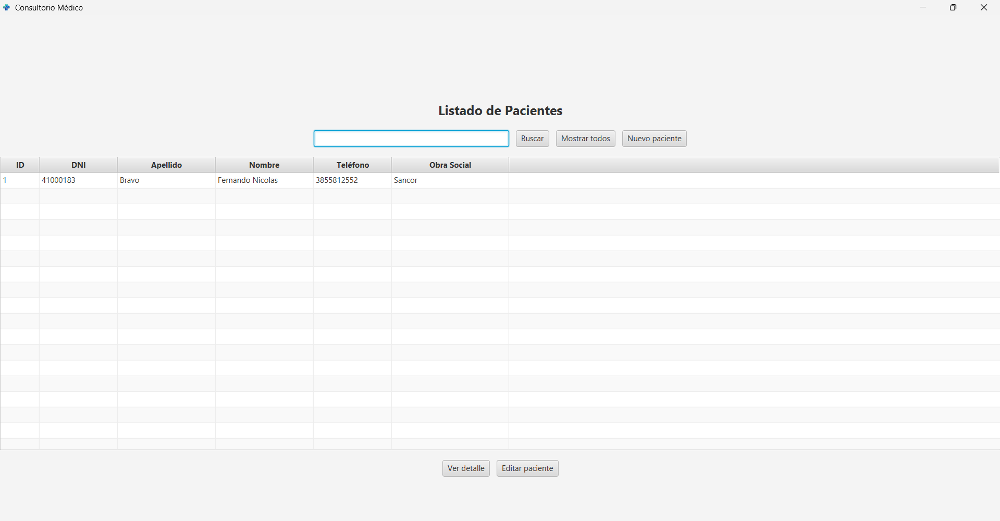
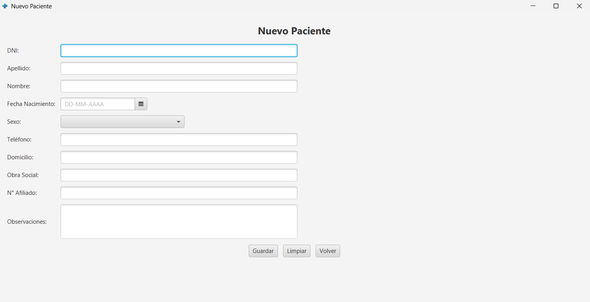
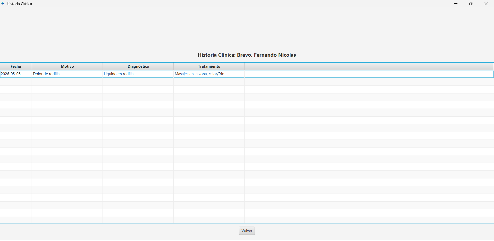
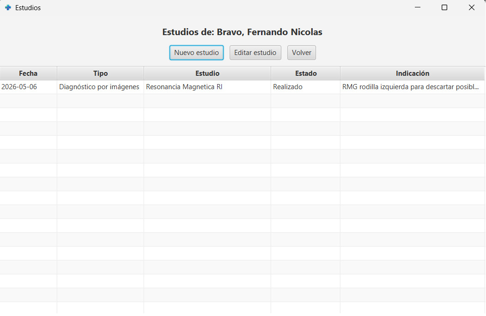

# Sistema de Consultorio Médico

Aplicación de escritorio desarrollada en JavaFX para la gestión de pacientes, consultas médicas, historia clínica y estudios solicitados.

## Funcionalidades

- Alta, edición y búsqueda de pacientes
- Búsqueda en tiempo real
- Vista de detalle del paciente
- Registro de consultas médicas
- Edición de consultas
- Historia clínica por paciente
- Registro de estudios solicitados
- Módulo de laboratorio / diagnóstico por imágenes
- Conexión con base de datos MySQL

## Capturas

### Listado de pacientes


### Nuevo paciente


### Historia clínica


### Estudios



## Tecnologías utilizadas

- Java
- JavaFX
- Maven
- MySQL
- JDBC

## Ejecución del proyecto

```bash
mvn clean javafx:run