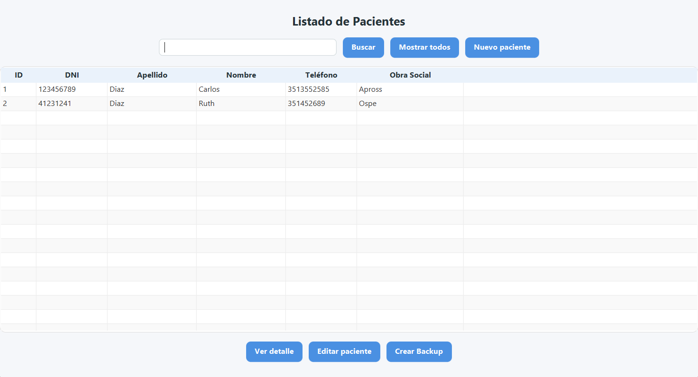
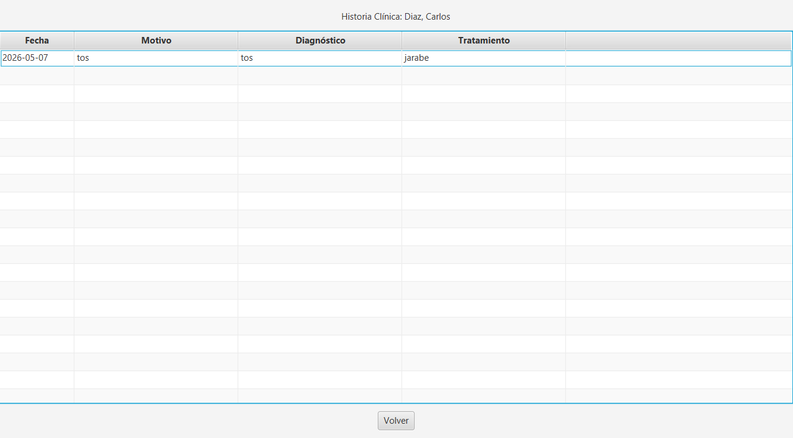
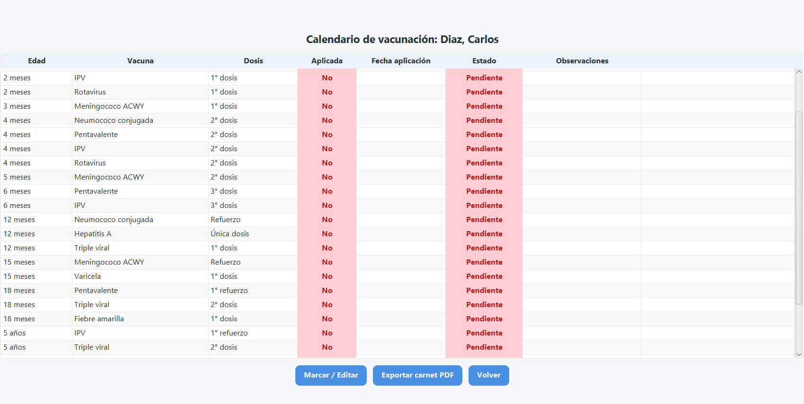

# 🩺 Sistema de Consultorio Médico

Aplicación de escritorio desarrollada en **Java y JavaFX** para la gestión integral de un consultorio médico.

Permite administrar pacientes, consultas, historia clínica, estudios y vacunación desde una interfaz centralizada, con persistencia local mediante **SQLite**, generación de documentos PDF y sistema de respaldo de información.

> Proyecto desarrollado a partir de una necesidad real y utilizado como sistema de gestión en consultorio.

---

## 📌 Funcionalidades principales

* Registro, edición y búsqueda de pacientes.
* Gestión de consultas médicas.
* Historia clínica por paciente.
* Registro de diagnósticos y tratamientos.
* Gestión de estudios solicitados.
* Calendario de vacunación pediátrica.
* Control de vacunas aplicadas y pendientes.
* Exportación del carnet de vacunación a PDF.
* Persistencia local de datos.
* Sistema de backups.
* Ejecución como aplicación de escritorio en Windows.

---

## 🛠️ Stack tecnológico

| Tecnología       | Uso                                |
| ---------------- | ---------------------------------- |
| **Java 21**      | Lógica principal de la aplicación  |
| **JavaFX 21**    | Interfaz gráfica                   |
| **SQLite**       | Persistencia local                 |
| **JDBC**         | Acceso a base de datos             |
| **Maven**        | Gestión de dependencias y proyecto |
| **iText PDF**    | Generación de documentos PDF       |
| **Git / GitHub** | Control de versiones               |

---

## 🧩 Módulos del sistema

### 👤 Pacientes

Centraliza la información personal y administrativa de cada paciente, permitiendo registrar, editar y consultar sus datos.

### 🩺 Historia clínica

Permite registrar consultas, diagnósticos y tratamientos, manteniendo un historial médico asociado a cada paciente.

### 🔬 Estudios

Gestiona los estudios solicitados y permite mantener organizada la información relacionada con cada paciente.

### 💉 Vacunación

Incluye un calendario de vacunación pediátrica para registrar vacunas aplicadas, identificar dosis pendientes y consultar el estado del esquema.

### 📄 Documentos

Permite generar documentación en formato PDF, incluyendo el carnet de vacunación.

### 💾 Backups

Incorpora mecanismos de respaldo para proteger la información almacenada localmente.

---

## 🗄️ Persistencia de datos

La aplicación utiliza **SQLite** como base de datos local.

Esta decisión permite que cada instalación funcione de manera independiente, sin necesidad de mantener un servidor de base de datos externo.

El acceso y las operaciones sobre los datos se realizan mediante **JDBC**.

---

## 🏗️ Enfoque técnico

El proyecto fue desarrollado separando la interfaz gráfica, la lógica de la aplicación y el acceso a los datos.

Durante su desarrollo se trabajó especialmente sobre:

* Modelado y persistencia de información.
* Relaciones entre pacientes, consultas y registros clínicos.
* Validación de formularios y datos ingresados.
* Navegación entre diferentes módulos JavaFX.
* Consultas y operaciones SQL.
* Generación de documentos PDF.
* Manejo de archivos y backups.
* Distribución de una aplicación Java para Windows.

---

## 📸 Capturas

### Gestión de pacientes



### Historia clínica



### Vacunación



> Las capturas disponibles pueden variar según la versión actual del proyecto.

---

## ▶️ Ejecución para desarrollo

### Requisitos

* Java JDK 21
* Maven

Clonar el repositorio:

```bash
git clone https://github.com/ferbravo98/ConsultorioMedico.git
```

Ingresar al proyecto:

```bash
cd ConsultorioMedico
```

Ejecutar:

```bash
mvn clean javafx:run
```

---

## 🎯 Qué demuestra este proyecto

Este proyecto representa una solución de mayor alcance dentro de mi portfolio y me permitió trabajar sobre un caso de uso real combinando:

**Java · JavaFX · SQL · persistencia de datos · diseño de interfaces · generación de documentos · distribución de software y soporte a usuarios.**

Su evolución no se limitó al desarrollo inicial: también implicó instalación, pruebas, resolución de incidencias y mantenimiento del sistema en entornos de uso real.

---

## 🚀 Próximas mejoras

* Gestión de usuarios y roles.
* Búsquedas y filtros avanzados.
* Mejoras en reportes y documentos PDF.
* Panel de estadísticas.
* Mejoras de interfaz y experiencia de usuario.
* Ampliación de herramientas de respaldo y recuperación.

---

## 👨‍💻 Autor

**Fernando Bravo**

Analista de Sistemas · Estudiante de Licenciatura en Informática

GitHub: https://github.com/ferbravo98
