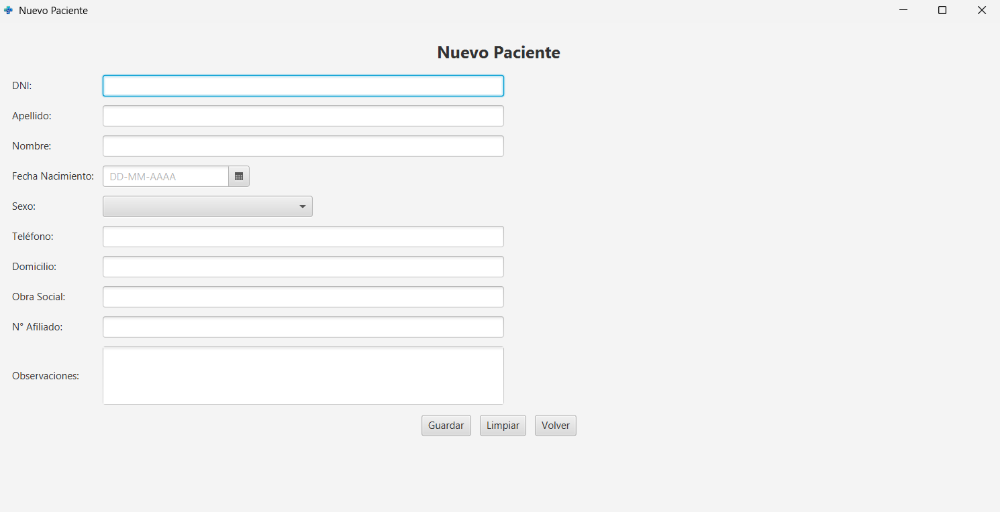
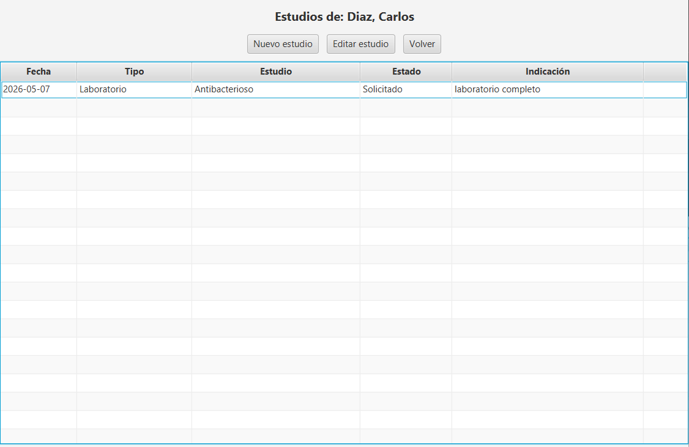

# Sistema de Consultorio Médico

Aplicación de escritorio desarrollada en JavaFX para la gestión de pacientes, consultas médicas, historia clínica y estudios solicitados.

## Funcionalidades

- Gestión de pacientes
- Edición de datos del paciente
- Búsqueda en tiempo real
- Historia clínica
- Registro y edición de consultas
- Registro de estudios
- Calendario de vacunación pediátrica
- Exportación de carnet de vacunación en PDF
- Sistema de backups
- Base local SQLite
- Ejecutable portable para Windows

## Capturas

### Listado de pacientes


### Nuevo paciente


### Historia clínica


### Estudios



## Tecnologías utilizadas

- Java
- JavaFX
- Maven
- MySQL
- JDBC

## Módulos del sistema

### Gestión de Pacientes
Permite registrar, editar y consultar pacientes. Incluye búsqueda en tiempo real por nombre, apellido o DNI.

### Historia Clínica
Permite almacenar consultas médicas, diagnósticos, tratamientos y observaciones.

### Estudios Médicos
Registro de estudios solicitados, resultados y observaciones asociadas al paciente.

### Vacunación Pediátrica
Control de vacunas aplicadas, pendientes y próximas según el calendario nacional argentino.

### Exportación PDF
Generación de carnet de vacunación en formato PDF para impresión o entrega digital.

### Sistema de Backups
Creación automática de copias de seguridad de la base SQLite para evitar pérdida de información.

## Ejecución del proyecto

```bash
mvn clean javafx:run